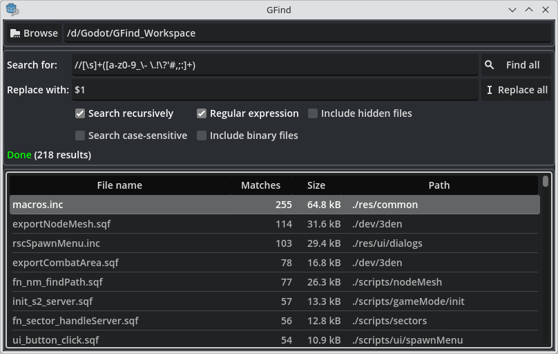

# GFind

	

## Description

**GFind** is a stand-alone text search and replace tool made with the Godot game engine.

Originally started as a learning project and a low-effort attempt to replace KDE's [KFind](https://apps.kde.org/kfind/) app, this tool has become my daily driver for search and replace operations on platforms where existing alternatives such as Stefan Küng's [grepWin](https://tools.stefankueng.com/grepWin.html) are not available.

## Features
### Implemented:
- Recursive search
- Search case sensitive
- Search using regular expressions
- Include binary files in search
- Include hidden files in search
- Persistent user preferences across sessions

### Planned:
- Better status reporting/visuals
- Extended previews with colour highlighting?

## License

GFind is distributed under the terms of the [Apache-2.0 license](https://github.com/Cre8or/GFind/blob/main/LICENSE).
